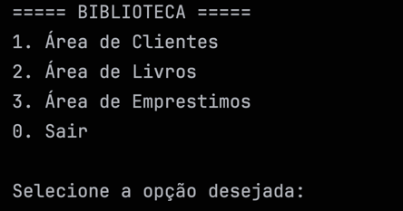
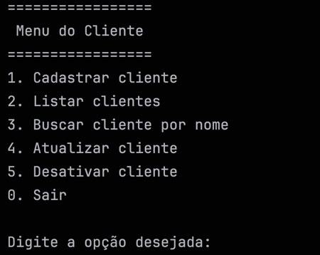
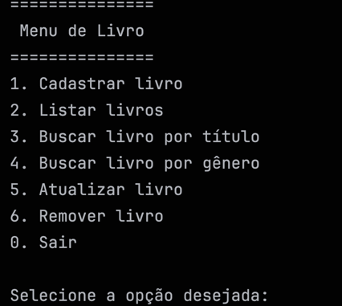
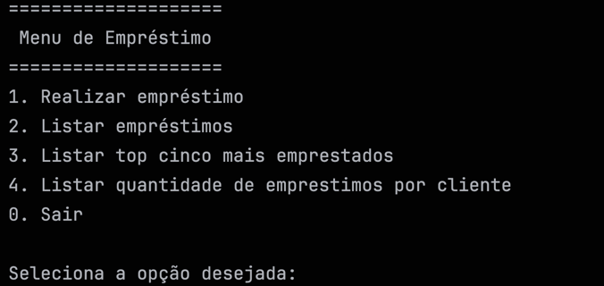

# 📚 Sistema de Gerenciamento de Biblioteca

> Aplicação de console desenvolvida em Java para simular a rotina de uma biblioteca, com persistência em PostgreSQL via JDBC puro. Projeto prático de estudos, criado para consolidar conhecimentos sólidos em backend antes de avançar para frameworks como Spring.


## 📑 Índice

- [Sobre o Projeto](#-sobre-o-projeto)
- [Demonstração](#️-demonstração)
- [Funcionalidades](#-funcionalidades)
- [Aprendizados e Conceitos Praticados](#-aprendizados-e-conceitos-praticados)
- [Tecnologias Utilizadas](#-tecnologias-utilizadas)
- [Estrutura do Projeto](#-estrutura-do-projeto)
- [Como Executar o Projeto](#-como-executar-o-projeto)
- [Próximos Passos / Melhorias Futuras](#-próximos-passos--melhorias-futuras)
- [Autor](#-autor)

## 📖 Sobre o Projeto

O **Sistema de Gerenciamento de Biblioteca (SGB)** é uma aplicação de console desenvolvida em Java, criada como projeto prático de estudos para consolidar conhecimentos em **JDBC, PostgreSQL, Programação Orientada a Objetos, Collections e organização de código em camadas** (Model, DAO, Service e View).

O sistema simula as operações do dia a dia de uma biblioteca: cadastro e gerenciamento de clientes e livros, controle de empréstimos e geração de relatórios simples, como o ranking dos livros mais emprestados e a quantidade de empréstimos por cliente.

## 🖥️ Demonstração

<table>
  <tr>
    <td></td>
    <td></td>
  </tr>
  <tr>
    <td></td>
    <td></td>
  </tr>
</table>

### Diagrama do Banco de Dados

O projeto já inclui um diagrama entidade-relacionamento do banco de dados:


## ⚙️ Funcionalidades

### 👤 Clientes
- Cadastrar cliente
- Listar clientes ativos
- Buscar cliente por nome
- Atualizar dados de um cliente
- Desativar cliente

### 📖 Livros
- Cadastrar livro
- Listar livros disponíveis em estoque
- Buscar livro por título
- Buscar livro por gênero
- Atualizar dados de um livro
- Remover livro

### 🔄 Empréstimos
- Registrar um novo empréstimo
- Listar todos os empréstimos (com nome do cliente e do livro)
- Visualizar o **Top 5** livros mais emprestados
- Visualizar a **quantidade de empréstimos por cliente**

## 🎓 Aprendizados e Conceitos Praticados

Este projeto foi utilizado como campo de prática para os seguintes conceitos:

- **Arquitetura em camadas**: separação clara de responsabilidades entre `Model`, `DAO` (acesso a dados), `Service` (regras de negócio) e `View` (menus de console)
- **JDBC puro**, sem uso de ORM — controle manual do ciclo completo de conexão, `PreparedStatement` e `ResultSet`
- **Prevenção de SQL Injection** com `PreparedStatement` em 100% das queries da aplicação
- **Controle manual de transações** (`commit` / `rollback` / `setAutoCommit(false)`) para garantir consistência dos dados
- **Connection Pooling** com HikariCP, evitando o custo de abrir/fechar conexões a cada operação
- **Boas práticas de segurança**: credenciais do banco isoladas em variáveis de ambiente (`.env` + `dotenv-java`), com o arquivo devidamente listado no `.gitignore`
- **Exceções de negócio customizadas** (`ValidacaoException`) para validações da camada de serviço
- **Java Records** para modelagem imutável e concisa das entidades e DTOs
- **Text Blocks** (Java 15+) para deixar SQLs e telas de console mais legíveis
- **Collections** (`List`, `ArrayList`) para manipular os dados retornados do banco
- **Consultas SQL com `JOIN`, `GROUP BY`, `COUNT` e `LIMIT`** para gerar os relatórios (Top 5 e ranking por cliente)
- **Scripts SQL versionados** (`V1__`, `V2__`) para controle evolutivo do schema do banco

## 🛠️ Tecnologias Utilizadas

| Tecnologia | Versão | Finalidade |
|---|---|---|
| Java | 25 | Linguagem principal da aplicação |
| Maven | — | Gerenciamento de dependências e build |
| PostgreSQL | — | Banco de dados relacional |
| PostgreSQL JDBC Driver | 42.7.13 | Conexão entre a aplicação e o banco |
| HikariCP | 7.1.0 | Pool de conexões com o banco de dados |
| dotenv-java | 3.2.0 | Carregamento de variáveis de ambiente a partir do `.env` |
| Git & GitHub | — | Controle de versão |

## 📂 Estrutura do Projeto

```
src/main/java/
├── Main.java                    # Ponto de entrada da aplicação (menu principal)
├── database/
│   └── ConnectionFactory.java   # Configuração do pool de conexões (HikariCP + dotenv)
├── model/                       # Entidades e DTOs (Java Records)
│   ├── Cliente.java
│   ├── Livro.java
│   ├── Emprestimo.java
│   ├── EmprestimoNomeado.java   # Projeção de empréstimo com nomes (via JOIN)
│   ├── EmprestimoTopCinco.java  # DTO do relatório Top 5
│   └── EmprestimoCliente.java   # DTO de empréstimos por cliente
├── DAO/                         # Acesso a dados — JDBC + SQL puro
│   ├── ClienteDAO.java
│   ├── LivroDAO.java
│   └── EmprestimoDAO.java
├── service/                     # Regras de negócio e validações
│   ├── ClienteService.java
│   ├── LivroService.java
│   └── EmprestimoService.java
├── util/                        # Camada de apresentação (menus de console)
│   ├── Menu.java
│   ├── ClienteMenu.java
│   ├── LivroMenu.java
│   └── EmprestimoMenu.java
└── exception/
    └── ValidacaoException.java  # Exceção customizada para regras de negócio

scripts_sql/
├── V1__create_tables.sql        # Criação das tabelas (cliente, livro, emprestimo)
└── V2__insert_values.sql        # Dados de exemplo (seed) para testes
```

## 🚀 Como Executar o Projeto

### Pré-requisitos

- [JDK 25](https://jdk.java.net/25/) ou superior
- [Maven 3.8+](https://maven.apache.org/download.cgi)
- [PostgreSQL](https://www.postgresql.org/download/) instalado e em execução
- Git

### Passo a passo

**1. Clone o repositório**
```bash
git clone https://github.com/SEU-USUARIO/sistema-gerenciamento-biblioteca.git
cd sistema-gerenciamento-biblioteca
```

**2. Crie o banco de dados no PostgreSQL**
```sql
CREATE DATABASE biblioteca;
```

**3. Execute os scripts SQL, na ordem, para criar as tabelas e popular os dados de exemplo**
```bash
psql -U seu_usuario -d biblioteca -f scripts_sql/V1__create_tables.sql
psql -U seu_usuario -d biblioteca -f scripts_sql/V2__insert_values.sql
```

**4. Configure as variáveis de ambiente** — crie um arquivo `.env` na raiz do projeto (veja o formato abaixo)

**5. Compile o projeto**
```bash
mvn clean compile
```

**6. Execute a aplicação**

O projeto ainda não possui um plugin de execução configurado no `pom.xml`, então a forma mais simples de rodar é através da sua IDE (ex: IntelliJ IDEA — clique com o botão direito em `Main.java` → `Run`). Para rodar via terminal sem uma IDE, configure o `exec-maven-plugin` ou gere um *fat jar* com o `maven-shade-plugin` (veja [Próximos Passos](#-próximos-passos--melhorias-futuras)).

### Variáveis de Ambiente

Crie um arquivo `.env` na raiz do projeto com as seguintes chaves:

```env
DB_URL=jdbc:postgresql://localhost:5432/biblioteca
DB_USER=seu_usuario_postgres
DB_PASSWORD=sua_senha_postgres
```

> ⚠️ O `.env` já está listado no `.gitignore` — nunca versione suas credenciais reais.

## 🔮 Próximos Passos / Melhorias Futuras

- [ ] Implementar testes automatizados (JUnit + Mockito)
- [ ] Evoluir a aplicação para uma API REST com **Spring Boot**
- [ ] Migrar a camada de persistência de JDBC puro para **Spring Data JPA / Hibernate**
- [ ] Adicionar autenticação e autorização com **Spring Security**
- [ ] Adicionar paginação nas listagens
- [ ] Substituir os `System.out.println` por um framework de logging (SLF4J + Logback)
- [ ] Tornar a leitura do console mais robusta (tratar entradas inválidas sem quebrar a aplicação)
- [ ] Padronizar nomenclatura dos campos entre os records (ex: `id_cliente` → `idCliente`)
- [ ] Padronizar convenções de nomenclatura de pacotes (ex: `dao` em vez de `DAO`, conforme convenção oficial do Java)
- [ ] Configurar `exec-maven-plugin` ou `maven-shade-plugin` para facilitar a execução via terminal
- [ ] Containerizar aplicação e banco de dados com Docker / Docker Compose
- [ ] Adicionar uma licença de código aberto (ex: MIT)

## 👨‍💻 Autor

Desenvolvido por **Nyk** durante meus estudos de desenvolvimento backend em Java.

[](https://github.com/nykovas)
[](https://linkedin.com/in/bruno-celestino-a5b1423a4)
